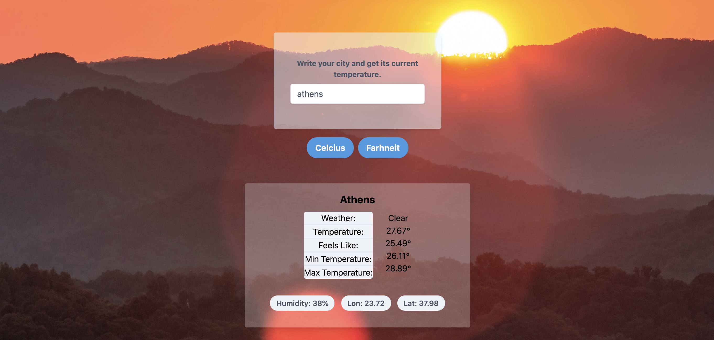

### Project Weather App - Javascript

This is my weather app created in Javascript. I'm using the open-weather-API to retrieve the data and output it in the browser. Also, I have added the Geolocation attribute so each time you are visiting the page for the first time, you will be asked if you allowing it to showcase the weather data from your location. The background image is changing according to the data you are getting back from API and depended to the current weather situation in the requested location. You can see the temperature both in Celsius and Fahrenheit by clicking the specific button. There plenty of details showing like minimum temperature, maximum temperature, humidity, longitude and latitude. Everything is created from Javascript and gets appended to the HTML file. I'm using webpack v4.43.0. There are 2 different configuration files, one for development and one for production. The plugins I'm using are:

- Html webpack plugin
- style loader
- css-loader
- sass-loader
- webpack-dev-server
- url-loader
- tailwindcss
- clean-webpack-plugin
- mini-css-extract-plugin
- node-sass
- optimize-css-assets-webpack-plugin
- postcss-loader

Lastly, I used Tailwind CSS for this project

- Sunny Screenshot

- Cloudy Screenshot

- Rainy Screenshot

### FEATURES

In this project I'm using webpack and API to retrieve the requested data. For styling of the application I used Tailwind CSS.

### BUILT WITH

- HTML
- CSS
- Javascript
- Tailwind CSS
- Sass
- Webpack
- Open Weather API
- Geolocation API

[Live Version - Githack](https://rawcdn.githack.com/mariosknl/weather_app_javascript/0636868ea89002800ae9788bf1ca4cf2a9308c7a/dist/index.html)

### SETUP
- git clone `git@github.com:mariosknl/weather_app_javascript.git`
- `npm start` in the terminal to test it locally.
- `npm run build` will create the updated version. Check `dist/index.html` in the broswer to see it in production mode. 

### AUTHORS

👤 Marios Kanellopoulos
- Github: [@mariosknl](https://github.com/mariosknl)
- Twitter: [@mariosknl](https://twitter.com/MariosKnl)
- Linkedln: [marios-kanellopoulos](https://www.linkedin.com/in/marios-kanellopoulos)
- Portfolio: [marios-kanellopoulos](https://marioskanellopoulos.com/)

### Acknowledgments
- [Microverse](https://www.microverse.org/)
- [The Odin Project](https://www.theodinproject.com/courses/javascript/lessons/weather-app)
- [Open Weather API](https://openweathermap.org/api)
- [Freecodecamp Youtube webpack video tutorial](https://www.youtube.com/watch?v=MpGLUVbqoYQ&t=5304s)
- [Expedito Inácio de Andrade Neto](https://expjazz.github.io/expedito_andrade/)
- [Unsplash.com](https://unsplash.com/) - Images
- [Tailwind CSS](https://tailwindcss.com/)

### 🤝 Contributing
Contributions, issues, and feature requests are welcome!
Feel free to check the issues page.

### Show your support
Give a ⭐️ if you like this project!

### 📝 License
This project is MIT licensed
